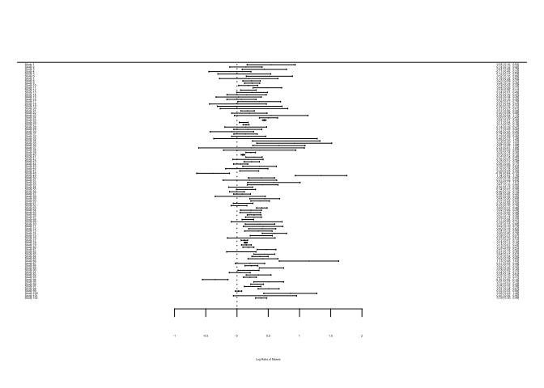
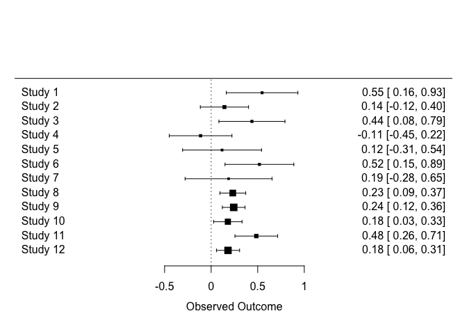
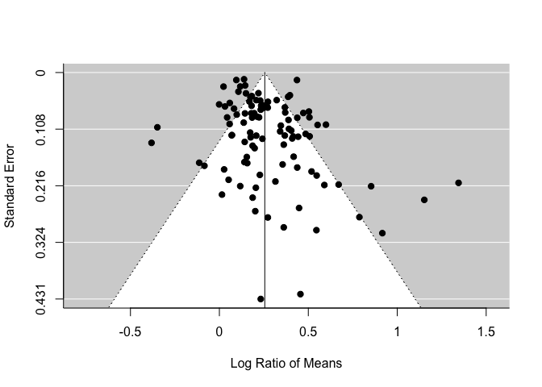
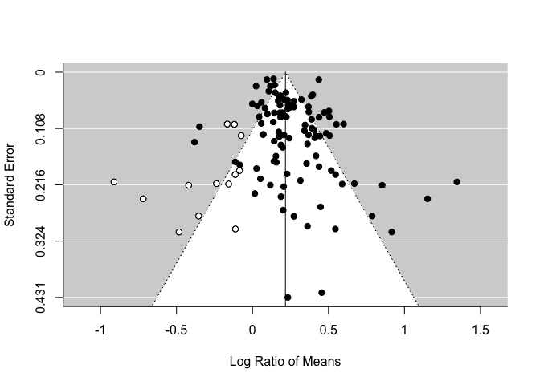
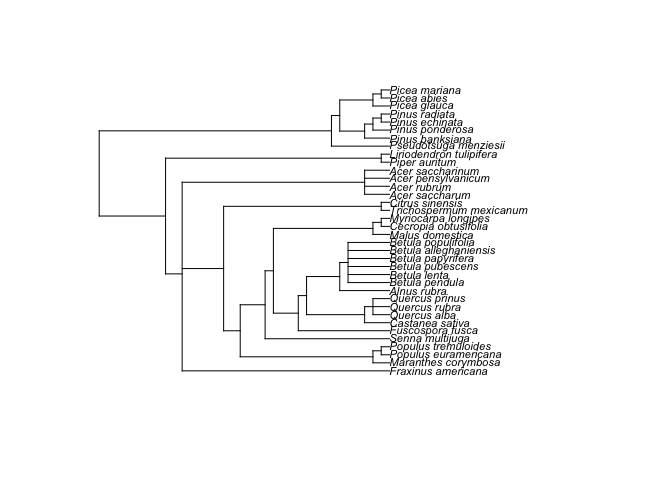

Meta-analysis using metafor
===========================

Background
----------

What is a meta-analysis?

> A meta-analysis is a quantitative summary of studies on the same topic.

Why do we want to perform a meta-analysis?

1.  Finding generalities
2.  Increasing power and precision
3.  Exploring differences between studies
4.  Settling controversies from conflicting studies (testing hypotheses)
5.  Generating new hypotheses


### The process of meta-analysis

How many steps involved in meta-analysis?

One answer is 5 steps

1.  Formulating questions & hypothesis or finding a topic
2.  Literature search & paper collection
3.  Data extraction & coding
4.  Meta-analysis & publication bias tests
5.  Reporting & publication

We only consider the step iv in this session. You have to learn the other steps elsewhere (we will be working on a 3-days workshop to cover all the steps).

Alternatively, we recently wrote an overview paper which divides the process of meta-analysis into 10 questions (Nakagawa et al. 2017). The 10 questions will guide you through judging the quality of a meta-analysis.

1.  Is the search systematic and transparently documented?
2.  What question and what effect size?
3.  Is non-independence taken into account?
4.  Which meta-analytic model?
5.  Is the level of consistency among studies reported?
6.  Are the causes of variation among studies investigated?
7.  Are effects interpreted in terms of biological importance?
8.  Has publication bias been considered?
9.  Are results really robust and unbiased?
10. Is the current state (and lack) of knowledge summarized?

Metafor for meta-analysis
-------------------------

I think the R package `metafor` (Viechtbauer 2010) is the most comprehensive meta-analytic software and the author [Wolfgang Viechtbauer](http://www.wvbauer.com/doku.php), who I have to say, has the coolest name among my friends, is still actively developing it. Let's load the `metafor` package and have a look at the data set named `dat.curtis1998`. If you have to see the other data sets included in this package. Try `help(package="metafor")`.

``` r
# install.packages('metafor')
library(metafor)
dat <- get(data(dat.curtis1998))
str(dat)
```

    ## 'data.frame':    102 obs. of  20 variables:
    ##  $ id      : int  21 22 27 32 35 38 44 63 86 87 ...
    ##  $ paper   : int  44 44 121 121 121 121 159 183 209 209 ...
    ##  $ genus   : chr  "ALNUS" "ALNUS" "ACER" "QUERCUS" ...
    ##  $ species : chr  "RUBRA" "RUBRA" "RUBRUM" "PRINUS" ...
    ##  $ fungrp  : chr  "N2FIX" "N2FIX" "ANGIO" "ANGIO" ...
    ##  $ co2.ambi: num  350 350 350 350 350 350 350 395 350 350 ...
    ##  $ co2.elev: num  650 650 700 700 700 700 700 795 700 700 ...
    ##  $ units   : chr  "ul/l" "ul/l" "ppm" "ppm" ...
    ##  $ time    : int  47 47 59 70 64 50 730 365 365 365 ...
    ##  $ pot     : chr  "0.5" "0.5" "2.6" "2.6" ...
    ##  $ method  : chr  "GC" "GC" "GH" "GH" ...
    ##  $ stock   : chr  "SEED" "SEED" "SEED" "SEED" ...
    ##  $ xtrt    : chr  "FERT" "FERT" "NONE" "NONE" ...
    ##  $ level   : chr  "HIGH" "CONTROL" "." "." ...
    ##  $ m1i     : num  6.82 2.6 2.99 5.91 4.61 ...
    ##  $ sd1i    : num  1.77 0.667 0.856 1.742 1.407 ...
    ##  $ n1i     : int  3 5 5 5 4 5 3 3 20 16 ...
    ##  $ m2i     : num  3.94 2.25 1.93 6.62 4.1 ...
    ##  $ sd2i    : num  1.116 0.328 0.552 1.631 1.257 ...
    ##  $ n2i     : int  5 5 5 5 4 3 3 3 20 16 ...

This data set is from the paper by Curtis and Wang (1998). They looked at the effect of increased CO**<sub>2</sub> on plant traits (mainly changes in biomass). So we have information on control group (1) and experimental group (2) (m = mean, sd = standard deviation) along with species information and experimental details. In meta-analysis, these variables are often referred to as 'moderators' (we will get to this a bit later).

### Calculating 'standarized' effect sizes

There are several 'standardized' effect sizes, which are unit-less. When we have two groups to compare, we use two types of effect size statistics. The first one is standardized mean difference (SMD or also known as Cohen's *d* or Hedge's *d* or *g*; some subtle differences between them, but we do not worry about them for now):

$$
\begin{aligned}
\mathrm{SMD}=\frac{\bar{x}_{E}-\bar{x}_{C}}{\sqrt{\frac{(n_{C}-1)sd^2_{C}+(n_{E}-1)sd^2_{E}}{n_{C}+n_{E}-2}}}
\end{aligned}
$$
 where $\bar{x}_{C}$ and $\bar{x}_{E}$ are the means of the control and experimental group, respectively, *s**d* is sample standard deviation (*s**d*<sup>2</sup> is sample variance) and *n* is sample size.

And its sample error variance is:

$$
\begin{aligned}
se^2_{\mathrm{SMD}}= \frac{n_{C}+n_{E}}{n_{C}n_{E}}+\frac{\mathrm{SMD}^2}{2(n_{C}+n_{E})}
\end{aligned}
$$

The square root of this is referred to as 'standard error' (or the standard deviation of the estimate -- confused?). The inverse of this (1/*s**e*<sup>2</sup>) is used as 'weight', but things are bit more complicated than this as we will find out below.

Another common index is called 'response ratio', which is usually presented in its natural logarithm form (lnRR):

And its sampling error variance is:

Let's get these using the function `escalc` in `metafor`.

``` r
# SMD
SMD <- escalc(measure = "SMD", n1i = dat$n1i, n2i = dat$n2i, m1i = dat$m1i, 
    m2i = dat$m2i, sd1i = dat$sd1i, sd2i = dat$sd2i)
head(SMD)
```

    ##        yi     vi
    ## 1  1.8222 0.7408
    ## 2  0.5922 0.4175
    ## 3  1.3286 0.4883
    ## 4 -0.3798 0.4072
    ## 5  0.3321 0.5069
    ## 6  2.5137 0.9282

``` r
# lnRR - 'ROM' for the log transformed ratio of means

lnRR <- escalc(measure = "ROM", n1i = dat$n1i, n2i = dat$n2i, m1i = dat$m1i, 
    m2 = dat$m2i, sd1i = dat$sd1i, sd2i = dat$sd2i)
head(lnRR)
```

    ##        yi     vi
    ## 1  0.5470 0.0385
    ## 2  0.1425 0.0175
    ## 3  0.4378 0.0328
    ## 4 -0.1134 0.0295
    ## 5  0.1172 0.0468
    ## 6  0.5183 0.0355

The original paper used lnRR so we use it, but you may want to repeat analysis below using SMD to see whether results are consistent.

``` r
dat <- cbind(dat, data.frame(lnRR))
# we should see yi (effec size) and vi (sampling variance) are added
str(dat)
```

    ## 'data.frame':    102 obs. of  22 variables:
    ##  $ id      : int  21 22 27 32 35 38 44 63 86 87 ...
    ##  $ paper   : int  44 44 121 121 121 121 159 183 209 209 ...
    ##  $ genus   : chr  "ALNUS" "ALNUS" "ACER" "QUERCUS" ...
    ##  $ species : chr  "RUBRA" "RUBRA" "RUBRUM" "PRINUS" ...
    ##  $ fungrp  : chr  "N2FIX" "N2FIX" "ANGIO" "ANGIO" ...
    ##  $ co2.ambi: num  350 350 350 350 350 350 350 395 350 350 ...
    ##  $ co2.elev: num  650 650 700 700 700 700 700 795 700 700 ...
    ##  $ units   : chr  "ul/l" "ul/l" "ppm" "ppm" ...
    ##  $ time    : int  47 47 59 70 64 50 730 365 365 365 ...
    ##  $ pot     : chr  "0.5" "0.5" "2.6" "2.6" ...
    ##  $ method  : chr  "GC" "GC" "GH" "GH" ...
    ##  $ stock   : chr  "SEED" "SEED" "SEED" "SEED" ...
    ##  $ xtrt    : chr  "FERT" "FERT" "NONE" "NONE" ...
    ##  $ level   : chr  "HIGH" "CONTROL" "." "." ...
    ##  $ m1i     : num  6.82 2.6 2.99 5.91 4.61 ...
    ##  $ sd1i    : num  1.77 0.667 0.856 1.742 1.407 ...
    ##  $ n1i     : int  3 5 5 5 4 5 3 3 20 16 ...
    ##  $ m2i     : num  3.94 2.25 1.93 6.62 4.1 ...
    ##  $ sd2i    : num  1.116 0.328 0.552 1.631 1.257 ...
    ##  $ n2i     : int  5 5 5 5 4 3 3 3 20 16 ...
    ##  $ yi      : num  0.547 0.143 0.438 -0.113 0.117 ...
    ##   ..- attr(*, "measure")= chr "ROM"
    ##   ..- attr(*, "ni")= int  8 10 10 10 8 8 6 6 40 32 ...
    ##  $ vi      : num  0.0385 0.0175 0.0328 0.0295 0.0468 ...

We can visualize point estimates (effect size) and their 95% confidence intervals, CIs (based on sampling error variance) by using the `forest` function, which draws a forest plot for us.

``` r
forest(dat$yi, dat$vi)
```



The problem you see is that when there are many studies, a forest plot does not really work (unless you have very large screen!). Let's look at just the first 12 studies.

``` r
forest(dat$yi[1:12], dat$vi[1:12])
```



We can calculate many different kinds of effect sizes with `escalc`; other common effect size statistics include *Z**r* (Fisher's z-transformed correlation). By the way, along with my colleagues, I have proposed a new standardized effect size called lnCVR (the log of coefficient of variation ratio -- mouthful!), which compare variability of two groups rather than means. See whether you can calculate it with these data. Actually, the development version of `metafor`, let you do this with `escalc`-- [github page](https://github.com/cran/metafor). lnCVR is called "CVR" in `escalc`. Actually, if you re-analysis this data with lnCVR, you may be able to publish a paper! Nobody has done it yet. Do it tonight!

### Fixed-effect and random-effects models

There are two main models of meta-analysis: 1) the fixed-effect model and 2) the random-effect model (actually we say 3 types, but the third one is the extension of the second model). Because fixed effects mean something different in another context, this naming is a bit confusing. So people now call the first model 'common-effect' model. You can see a visual representation of these two models (from Figure 4 in Nakagawa et al. 2017).


A math representation for the common-effect model is:

where *y*<sub>*i*</sub> is the *i*th effect size (from *i*th study), *b*<sub>0</sub> is the overall mean (or meta-analytic mean), *e*<sub>*i*</sub> is a deviation from the overall mean and it is normally distributed with *v*<sub>*i*</sub>, which is the study specific sampling variance (you can get this from formulas above). Note that weights for this model are 1/*v*<sub>*i*</sub>. As you can see, this is a very simple model; basically, we are estimating the mean considering weights.

Importantly, this model is assuming that there is a common mean for all studies included. Is this realistic? Probably not, especially, if you are combining different species!

The random-effects model can be written as:

where *s*<sub>*i*</sub> is a study-specific deviation from the overall mean for *i*th study, it is normally distributed with the between-study variance, often referred to as *τ*<sup>2</sup>, and the others are the same as above. Unlike the common-effect model, a random-effect model assumes that different studies have different means. Note that weights for this model are 1/(*τ*<sup>2</sup> + *v*<sub>*i*</sub>). We revisit this point, as it turns out to be quite important.

### Running a common-effect model

Let's use the function `rma` to run a common-effect model.

``` r
# note that we are setting method = 'FE' - fixed-effect
common_m <- rma(yi = yi, vi = vi, method = "FE", data = dat)
summary(common_m)
```

    ## 
    ## Fixed-Effects Model (k = 102)
    ## 
    ##    logLik   deviance        AIC        BIC       AICc  
    ## -245.9580   769.0185   493.9160   496.5410   493.9560  
    ## 
    ## Test for Heterogeneity: 
    ## Q(df = 101) = 769.0185, p-val < .0001
    ## 
    ## Model Results:
    ## 
    ## estimate      se     zval    pval   ci.lb   ci.ub     
    ##   0.2088  0.0054  38.3374  <.0001  0.1982  0.2195  ***
    ## 
    ## ---
    ## Signif. codes:  0 '***' 0.001 '**' 0.01 '*' 0.05 '.' 0.1 ' ' 1

OK, it was easy! The overall mean is statistically significant and it's around 0.2. What does 0.2 mean? let's make this into the original scale.

``` r
# coverting lnRR to RR (without log)
exp(0.2)
```

    ## [1] 1.221403

This means a plant trait (e.g. mass) was 22% larger in the experimental (RR$=\\bar{x}\_{E}/\\bar{x}\_{C}$), which seems like a pretty large effect to me (remember we need to interpret our results in a biological meaningful way). Note that [Jensen's inequality](https://en.wikipedia.org/wiki/Jensen%27s_inequality) states that this is a bit of wrong but we do not get into this today.

### Running a randm-effects model

Now, we move onto the random-effects model - a more realistic model. Again, we use the `rma` function.

``` r
# REML which is the default and the best method for the random-effect
# meta-analysis
random_m <- rma(yi = yi, vi = vi, method = "REML", data = dat)
summary(random_m)
```

    ## 
    ## Random-Effects Model (k = 102; tau^2 estimator: REML)
    ## 
    ##   logLik  deviance       AIC       BIC      AICc  
    ##   7.0449  -14.0898  -10.0898   -4.8596   -9.9674  
    ## 
    ## tau^2 (estimated amount of total heterogeneity): 0.0262 (SE = 0.0053)
    ## tau (square root of estimated tau^2 value):      0.1619
    ## I^2 (total heterogeneity / total variability):   88.90%
    ## H^2 (total variability / sampling variability):  9.01
    ## 
    ## Test for Heterogeneity: 
    ## Q(df = 101) = 769.0185, p-val < .0001
    ## 
    ## Model Results:
    ## 
    ## estimate      se     zval    pval   ci.lb   ci.ub     
    ##   0.2553  0.0198  12.8899  <.0001  0.2165  0.2941  ***
    ## 
    ## ---
    ## Signif. codes:  0 '***' 0.001 '**' 0.01 '*' 0.05 '.' 0.1 ' ' 1

Compare the overall mean from this model with the common-effect model. Oh, the overall mean of the random-effects model is actually bigger than that of the fixed-effect model. OK, that sometimes happens (we will find out that this probably is an over-estimation later). We expect 95% CI is wider (i.e. more realistic) in this random-effects model as this model has a better assumption than the common-effect model.

### Understating heterogeniety

For this output from the random-effects model has more things than that of the common-effect model. We have `tau^2` (*τ*<sup>2</sup>) and `I^2` (*I*<sup>2</sup>), two very common measure of heterogeneity (note that `H^2`, or *H*<sup>2</sup> is a transformation of *I*<sup>2</sup>).

> Heterogeneity is variation in effet sizes, which is not accounted by the sampling error variance.

In other words, real variation in the data. I think *I*<sup>2</sup> is a quite important index as it can tell the percentage of real variation in your meta-analytic data. It can be given by (which you saw within the figure of the random-effects model above):

where $\bar{v}$ is a representative value of *v*<sub>*i*</sub> (or think $\bar{v}$ as the average of *v*<sub>*i*</sub> although it is not quite it). Note that the denominator is the whole variance which exists in the data. The benchmark values for *I*2 are 25, 50 and 75% for low, moderate and high heterogeneity, respectively (Higgins et al. 2003).

Our *I*<sup>2</sup> value is 88.9% so very high and this value is, as you expect, statistically significant, tested with the *Q* value (which follows a *χ*<sup>2</sup> distribution defined by the df value, in this case *d**f* = 101).

We recently did a meta-analysis of meta-analyses (a secondary meta-analysis) looking at what is the average value of *I*<sup>2</sup> in the field of ecology and evolution (Senior et al. 2016). The average value was 92%! So this indicates that we should really be fitting the random-effects model rather than the common-effect model because the latter assumes heterogeneity to be zero or *τ*<sup>2</sup> = 0 and *I*<sup>2</sup> = 0. Or is it really? We find this out later.

### Meta-regression (the random-effects model)

The existence of heterogeneity sets a scene for meta-regression. This means that we now put predictors ('moderators' in the meta-analytic terminology) into our model to explain heterogeneity (equivalent to normal regression models). Fitting meta-regression is pretty straightforward too. We fit three moderators collected by the authors: 1) `time` (how long the experiment was), 2) `method` (different ways of increasing CO**<sub>2</sub>), and 3) `fungroup` (functional group, i.e., angiosperm, gymnosperm or N**<sub>2</sub> fixer).

``` r
# REML which is the default and the best method for the random-effect
# meta-analysis
metareg <- rma(yi = yi, vi = vi, mod = ~time + method + fungrp, method = "REML", 
    data = dat)
summary(metareg)
```

    ## 
    ## Mixed-Effects Model (k = 102; tau^2 estimator: REML)
    ## 
    ##   logLik  deviance       AIC       BIC      AICc  
    ##   5.1938  -10.3876    3.6124   21.5628    4.8851  
    ## 
    ## tau^2 (estimated amount of residual heterogeneity):     0.0267 (SE = 0.0056)
    ## tau (square root of estimated tau^2 value):             0.1634
    ## I^2 (residual heterogeneity / unaccounted variability): 87.16%
    ## H^2 (unaccounted variability / sampling variability):   7.79
    ## R^2 (amount of heterogeneity accounted for):            0.00%
    ## 
    ## Test for Residual Heterogeneity: 
    ## QE(df = 96) = 658.4083, p-val < .0001
    ## 
    ## Test of Moderators (coefficient(s) 2:6): 
    ## QM(df = 5) = 2.9089, p-val = 0.7140
    ## 
    ## Model Results:
    ## 
    ##              estimate      se     zval    pval    ci.lb   ci.ub     
    ## intrcpt        0.3043  0.0516   5.8934  <.0001   0.2031  0.4055  ***
    ## time          -0.0001  0.0001  -1.0509  0.2933  -0.0002  0.0001     
    ## methodGH      -0.0369  0.0567  -0.6501  0.5157  -0.1481  0.0743     
    ## methodOTC      0.0308  0.0902   0.3410  0.7331  -0.1461  0.2076     
    ## fungrpGYMNO   -0.0454  0.0605  -0.7501  0.4532  -0.1640  0.0732     
    ## fungrpN2FIX    0.0044  0.1701   0.0258  0.9794  -0.3291  0.3379     
    ## 
    ## ---
    ## Signif. codes:  0 '***' 0.001 '**' 0.01 '*' 0.05 '.' 0.1 ' ' 1

Well, they do not explain anything! Look at the *R*<sup>2</sup> value and, as you expect, the test for moderators (again the Q value) say they are not significant. A terrible model! So we give up here (in a real meta-analysis, you need to do this more systematically, preferably based on your priori hypotheses).

### Checking for publication bias

OK, it seems like an CO**<sub>2</sub> increase promotes plant growth (which may not be surprising), but we are assuming the data set we have does not suffer form publication bias.

> Publication bias in its simplest form is that signficant results are more likely to be published than non-signficant results.

So if publication bias exists in this topic, we are a bit stuffed as our results will be biased. How can we check it? Actually, the problem is that we never really know how many non-significant results are missing from our data set as they are missing!

But there are several methods, which people have been using. The two commonest methods, often used as a set, are: 1) funnel plot, which one uses to detect a funnel asymmetry (a sign of publication bias), and 2) Egger's regression test with which you test funnel asymmetry statistically.

``` r
funnel(random_m)
```



``` r
# Note that the orignal Egger's test is regtest(random_m, model='lm')
regtest(random_m)
```

    ## 
    ## Regression Test for Funnel Plot Asymmetry
    ## 
    ## model:     mixed-effects meta-regression model
    ## predictor: standard error
    ## 
    ## test for funnel plot asymmetry: z = 3.2046, p = 0.0014

The funnel plot and Egger's test both suggest funnel asymmetry. But we need to be careful. Funnel asymmetry cannot be caused not only by publication bias but also by heterogeneity (one or more undetected moderators are distorting a funnel shape). Given we have a lot of unexplained variance (i.e. heterogeneity), we are not sure which is causing this asymmetry. But we have some evidence for publication bias. A relating point is that if meta-regression explains a lot of heterogeneity, you should use that meta-regression model in the function `regrest` (in our case `regrest(metareg)`, but I did not do it as our model `metareg` did not explain anything).

There is an alternative method, which has a cool name, the trim-and-fill method. You will see the reason why. We can use this method by using the function `trimfill`.

``` r
# Note that we are using the defult estimator ('L0'), but there are two
# others availablere
tf_m <- trimfill(random_m)
tf_m
```

    ## 
    ## Estimated number of missing studies on the left side: 13 (SE = 6.5629)
    ## 
    ## Random-Effects Model (k = 115; tau^2 estimator: REML)
    ## 
    ## tau^2 (estimated amount of total heterogeneity): 0.0421 (SE = 0.0076)
    ## tau (square root of estimated tau^2 value):      0.2053
    ## I^2 (total heterogeneity / total variability):   92.06%
    ## H^2 (total variability / sampling variability):  12.59
    ## 
    ## Test for Heterogeneity: 
    ## Q(df = 114) = 872.7669, p-val < .0001
    ## 
    ## Model Results:
    ## 
    ## estimate      se    zval    pval   ci.lb   ci.ub     
    ##   0.2166  0.0227  9.5234  <.0001  0.1721  0.2612  ***
    ## 
    ## ---
    ## Signif. codes:  0 '***' 0.001 '**' 0.01 '*' 0.05 '.' 0.1 ' ' 1

``` r
funnel(tf_m)
```



As you can see this method uses the asymmetry to add more points and provide a revised overall mean, which is smaller than that of the original random-effect model. Although this effect is still significant, this method could turn a significant overall mean into a non-significant one. But rather than taking this is a real estimate of the overall mean, we need to see this as a part of sensitivity analysis.

There are more methods for publication bias tests, none of which are perfect, but we do need to do some of these tests (see more for Nakagawa et al. 2017 and references therein).

### Another model (I did not know), but important!

I recently learned that there is another meta-analytic model (neither common nor random), which is more robust to publication bias. Remember what I said above.

1.  The random-effect model is a more realistic model so we should use this model.
2.  The random-effect model has the weight of 1/(*τ*<sup>2</sup> + *v*<sub>*i*</sub>).
3.  *I*<sup>2</sup> is very large in ecological and evolutionary meta-data sets so this means *τ*<sup>2</sup> is very large, meaning 1/(*τ*<sup>2</sup> + *v*<sub>*i*</sub>)≈1/*τ*<sup>2</sup> as *v*<sub>*i*</sub> is negligible
4.  Then, all data points having the same weight 1/*τ*<sup>2</sup> and basically it becomes an unweighted model!

This is problematic because under publication bias like we saw it just above, effect sizes with small sample sizes (very high *v*<sub>*i*</sub>) should get small weights compared to effect sizes with large sample sizes (low *v*<sub>*i*</sub>). When there exists publication bias, the random-effect model could provide us with a biased estimate... What could we do? Can we use the weight of 1/*v*<sub>*i*</sub> like the common-effect model, but use the structure of the random-effects model? It turns out you can!

``` r
# We make weights, which is 1/vi and stick that into the argument, weights
dat[, "wi"] <- 1/dat$vi
weight_m <- rma(yi = yi, vi = vi, weights = wi, method = "REML", data = dat)
summary(weight_m)
```

    ## 
    ## Random-Effects Model (k = 102; tau^2 estimator: REML)
    ## 
    ##   logLik  deviance       AIC       BIC      AICc  
    ##   4.2927   -8.5854   -4.5854    0.6448   -4.4630  
    ## 
    ## tau^2 (estimated amount of total heterogeneity): 0.0262 (SE = 0.0053)
    ## tau (square root of estimated tau^2 value):      0.1619
    ## I^2 (total heterogeneity / total variability):   88.90%
    ## H^2 (total variability / sampling variability):  9.01
    ## 
    ## Test for Heterogeneity: 
    ## Q(df = 101) = 769.0185, p-val < .0001
    ## 
    ## Model Results:
    ## 
    ## estimate      se    zval    pval   ci.lb   ci.ub     
    ##   0.2088  0.0473  4.4121  <.0001  0.1161  0.3016  ***
    ## 
    ## ---
    ## Signif. codes:  0 '***' 0.001 '**' 0.01 '*' 0.05 '.' 0.1 ' ' 1

Actually, this point estimate is the exactly the same as that of the common-effect model (this is not just a coincidence as this model calculates the overall mean like the common-effect model). But it is important to notice this model has a wider 97% CI than the common-effect model and this level of uncertainty is more realistic (just like the random-effects model). Basically, this model has got the best of both worlds!

This model is based on the paper by Henmi and Copas (2010). Although it is more robust to publication bias, I do not know any meta-analyses in the field of ecology and evolution, which uses this model. Probably we should be using this model rather than a random-effect model? I think so - let's call this model the 'robust' model. I think we should use this robust model for meta-regression too. I acknowledge Wolfgang telling me about this model to me.

### More complex models

Up to now, we completely ignored non-independence among effect sizes. We assumed that we have one effect size from one study (or paper). But in reality, a paper usually contains multiple effect sizes. These effect sizes from the same studies are not independent of each other. Let's consider model where we have several effect sizes from single studies like our data set. First, I give you a math representation:

where *u*<sub>*i**j*</sub> is a deviation from *s*<sub>*i*</sub> (the within-study effect; the *j*th effect size from the *i*th study),it is normally distributed with *σ*<sup>2</sup> (other notations are comparable as above).

We can visualize this (again Figure 4 from Nakagawa et al. 2017). And we can see why this model is called, a 'multilevel' meta-analytic model, an extension of the random-effects model.


We can fit an equivalent model using the function `rma.mv`. We need to add `paper` (the between-study effect) and `id` (the ) in our data set to the multilevel model as random factors.

``` r
multilevel_m <- rma.mv(yi = yi, V = vi, random = list(~1 | paper, ~1 | id), 
    method = "REML", data = dat)
summary(multilevel_m)
```

    ## 
    ## Multivariate Meta-Analysis Model (k = 102; method: REML)
    ## 
    ##   logLik  Deviance       AIC       BIC      AICc  
    ##   7.1102  -14.2204   -8.2204   -0.3750   -7.9730  
    ## 
    ## Variance Components: 
    ## 
    ##             estim    sqrt  nlvls  fixed  factor
    ## sigma^2.1  0.0015  0.0392     29     no   paper
    ## sigma^2.2  0.0248  0.1573    102     no      id
    ## 
    ## Test for Heterogeneity: 
    ## Q(df = 101) = 769.0185, p-val < .0001
    ## 
    ## Model Results:
    ## 
    ## estimate      se     zval    pval   ci.lb   ci.ub     
    ##   0.2578  0.0222  11.6046  <.0001  0.2142  0.3013  ***
    ## 
    ## ---
    ## Signif. codes:  0 '***' 0.001 '**' 0.01 '*' 0.05 '.' 0.1 ' ' 1

OK, this does not have *I*<sup>2</sup>. We have actually proposed a multilevel-model version of *I*<sup>2</sup> (Nakagawa & Santos 2012), which, in this case, can be written as:

Note that we do have *τ*<sup>2</sup> and *σ*<sup>2</sup>, which are `sigma^2.1` and `sigma^2.2` in the output above, respectively. Using this formula, we have the total heterogeneity *I*<sup>2</sup> of 88.93% (the $\\bar{v} = 0.0033$ for our data set; see Nakagawa & Santos 2012 for how to get this). As you might expect, this value is nearly identical to what we got from the random-effect model (88.9%). But this model is better as we are explicitly dealing with non-independence arising from effect sizes from the same studies (although it turns out the problem is not completely solved...).

As you could probably imagine, we can add more levels to this multilevel models. For example, we could add `genus` in the data set, as related species are probably more similar to each other. But it is better to model this taxonomic non-independence using phylogeny (which is the topic of the next section). Note that we can also run meta-regression using `rma.mv`; more complex models (different versions of a multilevel model) are explained in Nakagawa & Santos (2012).

### Phylogenetic meta-analysis

As I just mentioned, we have, so far, also ignored another type of non-independence, i.e. phylogenetic relatedness. Chuck Darwin unfortunately (or fortunately) found out all species on earth are related so we need to deal with this issue. Actually, we just need to model phylogenetic non-independence by adding the degree of relatedness among species as a correlation matrix. The term, phylogeny or `phylo`, which we will create below, can be added as a random factor to a multilevel model. This means that we need a phylogenetic tree for our data set. We have already prepared for it so we can use that [file](https://www.dropbox.com/s/d5pzkb9ezgx6798/tree_curtis1998.tre?dl=0). But it is not that difficult to get a tree together by using the package called `rotl`. We load our phylogeny and make a correlation matrix (a relatedness matrix among species).

``` r
# install.packages('ape')
library(ape)
tree <- read.tree(file = "tree_curtis1998.tre")
plot(tree, cex = 0.7)
```



``` r
# sorry I skip explantions of these operations - other than saying we have a
# correlation matrix to fit to the model
tree <- compute.brlen(tree)
cor <- vcv(tree, cor = T)
```

We need a bit more preparation as we do not have a column which has the whole species names (we call it `phylo`). Also, it turns out that we need to correct some typos in `genus` and `species` columns in our data.

``` r
# install.packages('Hmisc')
library(Hmisc)
phylo <- tolower(paste(dat$genus, dat$species, sep = "_"))
# note: 'populusx_euramericana' should be same as 'populus_euramericana'
phylo <- gsub("populusx_euramericana", "populus_euramericana", phylo)
# these two species are the two different names of the same species
phylo <- gsub("nothofagus_fusca", "fuscospora_fusca", phylo)
phylo <- capitalize(phylo)
dat[, "phylo"] <- phylo
```

We now have our phylogenetic correlation `cor` and a column with species names `phylo`.

``` r
# now putting phylogenetic effect and the correlation matrix
phylo_m <- rma.mv(yi = yi, V = vi, random = list(~1 | phylo, ~1 | paper, ~1 | 
    id), R = list(phylo = cor), method = "REML", data = dat)
summary(phylo_m)
```

    ## 
    ## Multivariate Meta-Analysis Model (k = 102; method: REML)
    ## 
    ##   logLik  Deviance       AIC       BIC      AICc  
    ##   7.1102  -14.2204   -6.2204    4.2401   -5.8037  
    ## 
    ## Variance Components: 
    ## 
    ##             estim    sqrt  nlvls  fixed  factor    R
    ## sigma^2.1  0.0000  0.0000     36     no   phylo  yes
    ## sigma^2.2  0.0015  0.0392     29     no   paper   no
    ## sigma^2.3  0.0248  0.1573    102     no      id   no
    ## 
    ## Test for Heterogeneity: 
    ## Q(df = 101) = 769.0185, p-val < .0001
    ## 
    ## Model Results:
    ## 
    ## estimate      se     zval    pval   ci.lb   ci.ub     
    ##   0.2578  0.0222  11.6046  <.0001  0.2142  0.3013  ***
    ## 
    ## ---
    ## Signif. codes:  0 '***' 0.001 '**' 0.01 '*' 0.05 '.' 0.1 ' ' 1

All this effort, there is no variation due to phylogeny! So we do not need this phylogeny term (i.e. `phylo`).

Also, this multilevel model can be considered as a comparative phylogenetic method. There are quite a few things you need to know and to be careful of, which I cannot cover (e.g. we assumed that the Brownian-motion model of evolution in the model above - what does this even mean?). But Will and I have written a nice 'primer' so please read that primer -- Cornwell & Nakagawa (2017)

Unfortunately, there are other types of non-independence from what covered here. We summaries all types in our recent paper -- Noble et al. (2017). So read this as well if you are interested.

### Complex robust models (the last section!)

We have a multilevel version of the robust model too. It is easy to fit using the function `rma.mv` (we do not include `phylo` as it did not explain any variance).

``` r
# you can put a marix or vector to W which is equivalent to 'weights' in rma
robustml_m <- rma.mv(yi = yi, V = vi, W = wi, random = list(~1 | paper, ~1 | 
    id), method = "REML", data = dat)
summary(robustml_m)
```

    ## 
    ## Multivariate Meta-Analysis Model (k = 102; method: REML)
    ## 
    ##   logLik  Deviance       AIC       BIC      AICc  
    ##   4.6819   -9.3639   -3.3639    4.4815   -3.1165  
    ## 
    ## Variance Components: 
    ## 
    ##             estim    sqrt  nlvls  fixed  factor
    ## sigma^2.1  0.0015  0.0392     29     no   paper
    ## sigma^2.2  0.0248  0.1573    102     no      id
    ## 
    ## Test for Heterogeneity: 
    ## Q(df = 101) = 769.0185, p-val < .0001
    ## 
    ## Model Results:
    ## 
    ## estimate      se    zval    pval   ci.lb   ci.ub     
    ##   0.2088  0.0483  4.3200  <.0001  0.1141  0.3036  ***
    ## 
    ## ---
    ## Signif. codes:  0 '***' 0.001 '**' 0.01 '*' 0.05 '.' 0.1 ' ' 1

I think this is the model we have been looking for, i.e. our final model. At least for this data set.

Any questions? Or email me (s(-dot-)nakagawa(-at-)unsw(-dot-)edu(-dot-)au). Also visit our [website](http://www.i-deel.org/)

Further help (references)
-------------------------

Go to the metafor package's [website](http://www.metafor-project.org/doku.php). There you find many worked examples.

Cornwell, W., and S. Nakagawa. 2017. Phylogenetic comparative methods. *Current Biology* 27:R333-R336.

Curtis, P. S., and X. Z. Wang. 1998. A meta-analysis of elevated CO2 effects on woody plant mass, form, and physiology. *Oecologia* 113:299-313.

Henmi, M., and J. B. Copas. 2010. Confidence intervals for random effects meta-analysis and robustness to publication bias. *Statistics in Medicine* 29:2969-2983.

Higgins, J. P. T., S. G. Thompson, J. J. Deeks, and D. G. Altman. 2003. Measuring inconsistency in meta-analyses. *British Medical Journal* 327:557-560.

Nakagawa, S., R. Poulin, K. Mengersen, K. Reinhold, L. Engqvist, M. Lagisz, and A. M. Senior. 2015. Meta-analysis of variation: ecological and evolutionary applications and beyond. *Methods in Ecology and Evolution* 6:143-152.

Nakagawa, S., D. W. A. Noble, A. M. Senior, and M. Lagisz. 2017. Meta-evaluation of meta-analysis: ten appraisal questions for biologists. *BMC Biology* 15:18.

Nakagawa, S., and E. S. A. Santos. 2012. Methodological issues and advances in biological meta-analysis. *Evolutionary Ecology* 26:1253-1274.

Noble, D. W. A., M. Lagisz, R. E. O'Dea, and S. Nakagawa. 2017. Nonindependence and sensitivity analyses in ecological and evolutionary meta-analyses. *Molecular Ecology* 26:2410-2425.

Senior, A. M., C. E. Grueber, T. Kamiya, M. Lagisz, K. O'Dwyer, E. S. A. Santos, and S. Nakagawa. 2016. Heterogeneity in ecological and evolutionary meta-analyses: its magnitude and implications. *Ecology* 97:3293-3299.

Viechtbauer, W. 2010. Conducting meta-analyses in R with the metafor package. *Journal of Statistical Software* 36:1-48.
